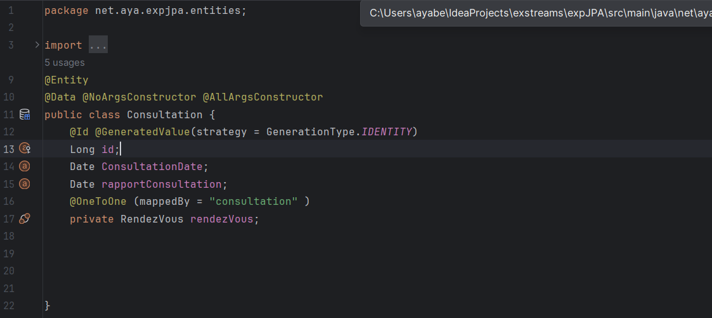
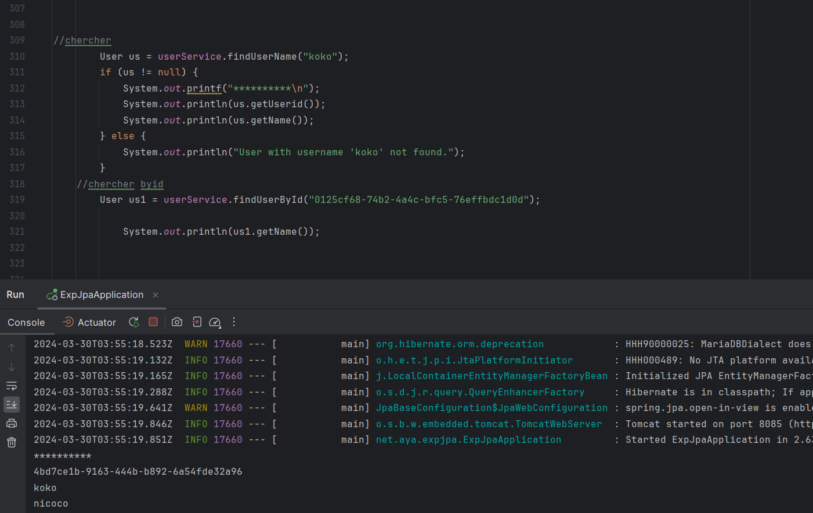

<h1>TP2</h1>
1-
2-
3-
4-
Voila bdd H2

5-
6-Ajouter des produits

    6.1- Consulter tous les produits

    6.2-Cherche un produit par son nom

    6.3-Consulter un  produits avec son ID

    6.4-mettre a jour un produit

    6.5-affichange de profuit en utilsant la base de donnees H2

    6.6-Supprimer un produit

7-MIgeation de la base de donnees H2 vers MySQL

   
8-
<h3>Patient class</h3>

**ajouter un patient**

**cherche tous les patient  et par id  **

class consultation

**ajouter une consultation**

***tous les crud de consultation avec l'affichage en console***

class medecin

**ajouter un medecin et chercher tous les medecin**

***tous les crud de medecin avec l'affichage en console***

class rendez-vous

**ajouter un rendez-vous **

***tous les crud de rendez-vous avec l'affichage en console***

Repisitory role 

Repisitory user

Interface userservice

implementation userservice

classs role

class user

**ajouter un user **

**ajouter un role **

**chrcher un user par son nom et id **

**Authentification

ajouter un uset to a role

